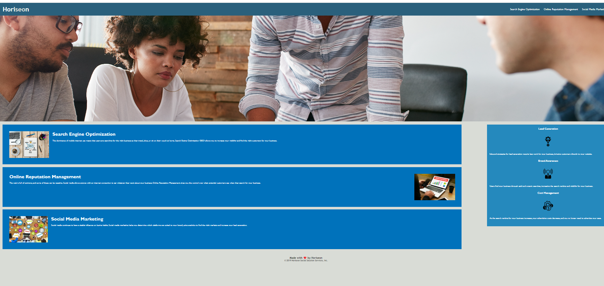

# FirstAssignment

#* **User Story**:-i had done some changes in HTML and Css file. I have used HTML5 semantics element like header,Footer,nave ,section and etc. In css,i kept universal tag under body tag.i have create folder screenshot where i kept all  screenshot per section. I I added comment in index file to understand section . i had done classes and elements in sequential order to understand easy. Everytime i had commit in github

* **Acceptance Criteria**::In this assignment , I had used everything which you nmention for making this assignment
1. I used sementic elements like header, nav, footer,  section etc
2. I used the alt tag inside image tag
3. I used comment in index file to understand section 
4. I changed the heading tag position in footer section
5. I had done setting the classes, tags and ids in sequential order
6. I used the 'title' tag inside image tag

